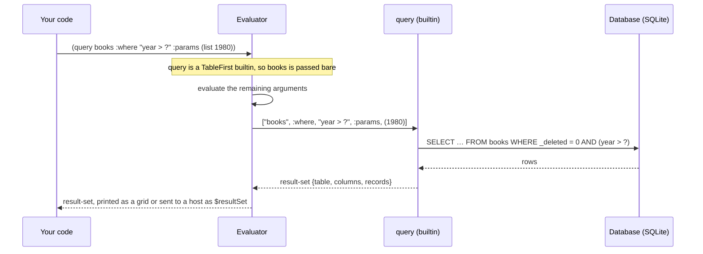

# 5. The database

EELisp has a dBASE-style database built in. Tables are real SQLite tables. SQLite is compiled
into the engine, so there's nothing to install. Each table's schema is stored as JSON next to the
data, so field types, defaults, required flags and choice lists survive a restart.

By default the engine uses an in-memory database. A host can name a file instead, for example
`eelisp --serve --db notes.db` or `Interpreter::with_database("notes.db")`. `(database-info)`
says which one is in use:

```lisp
(database-info)        ; → {:path ":memory:"}
```

## Defining a table

The short form lists `name:type` pairs:

```lisp
(deftable books (title:string author:string year:number))
```

The long form describes each field with keywords:

```lisp
(deftable tasks
  ((title  :type string :required true)
   (status :type string :default "open" :choices ("open" "done"))
   (due    :type date)))
```

The field types are `string`, `number`, `bool`, `date`, `memo` and `choice`. `:default` fills a
field that an insert leaves out. `:required` and `:choices` are part of the schema a host reads
to build its forms. The engine itself doesn't reject a row that breaks them.

```lisp
(tables)               ; → (_categories _items _rules _templates _views books tasks)
(describe tasks)       ; → #<table tasks (title:string status:string due:date)>
(drop-table tasks)
```

Tables whose names start with `_` belong to the [agenda](06-agenda.md).

## Naming a table

Table commands take the table's name *bare*, so `(query books)` doesn't evaluate `books`. When a
program works out the name at run time, pass a call instead, because a call in that position is
evaluated:

```lisp
(query books)                       ; the table named books
(def which "books")
(count-records (str which))         ; the table whose name str returns
```

## Rows in, rows out

```lisp
(insert books {:title "Thinking Forth" :author "Brodie" :year 1984})
; → {id: 1, title: "Thinking Forth", author: "Brodie", year: 1984}

(update books 1 {:year 1985})       ; change some fields of row 1
(delete books 1)                    ; a soft delete: the row is only marked
(pack books)                        ; really remove the marked rows
(count-records books)               ; how many live rows
```

A soft-deleted row disappears from queries and counts at once, but it stays in the file until
`pack` removes it.

### Queries

`query` returns a **result-set**. A result-set is a value that knows its table and columns. It
prints as a grid:

```lisp
(query books :where "year > ?" :params (list 1980) :order "year" :desc true)
```

```text
┌────┬────────────────┬─────────┬──────┐
│ id │ title          │ author  │ year │
├────┼────────────────┼─────────┼──────┤
│ 2  │ SICP           │ Abelson │ 1985 │
│ 1  │ Thinking Forth │ Brodie  │ 1984 │
└────┴────────────────┴─────────┴──────┘
```

| Option | Meaning |
|---|---|
| `:where "sql"` | an SQL condition, with `?` for each parameter |
| `:params (list …)` | values for the `?` placeholders, in order |
| `:order "field"` | sort by a field |
| `:asc true` / `:desc true` | the sort direction |
| `:limit n` | at most `n` rows |
| `:select (list "a" "b")` | only these columns |

Always pass values through `:params` rather than pasting them into `:where`. The engine binds
them as SQL parameters.

`count-records` takes the same `:where` and `:params`:

```lisp
(count-records books :where "year > ?" :params (list 1980))   ; → 2
```

### Records

`(records rs)` turns a result-set into an ordinary list of **records**, ready for `map`,
`filter` and the rest:

```lisp
(map (fn (r) (field-get r "title"))
     (records (query books :order "year")))
; → ("Lisp 1.5" "Thinking Forth" "SICP")

(def r (head (records (query books))))
(record-id r)                    ; → 1
(field-get r :title)             ; → "Thinking Forth" — a keyword or a string
(field-set r "title" "TF")       ; → a new record; the row is untouched until you update
```

## Grids and forms

A result-set is data, and a *view* is data with an intent: "show this to a person". Views are
how the database reaches a user interface.

```lisp
(browse books)          ; a table-view: an interactive grid
(edit books 1)          ; a form-view: one record in a form

;; a form over an existing table
(defform book-form () :source books)

;; a standalone form with a computed field
(defform invoice (qty:number price:number)
  :computed ((total (* qty price))))
```

On the command line, a table-view prints as an ASCII grid, and a form-view prints as a summary
such as `#<form invoice (qty price) 1 record(s) standalone>`. Inside EEditor, the same values
become a spreadsheet-like grid and a form. The host receives them as tagged JSON, with
`$tableView` and `$formView`, and draws them. A computed field travels with its expression
(`"(* qty price)"`), so the form can recalculate it as the user types. See
[Embedding](10-embedding.md#the-json-shape-of-values).

## How a query travels



Continue with [The agenda](06-agenda.md).
