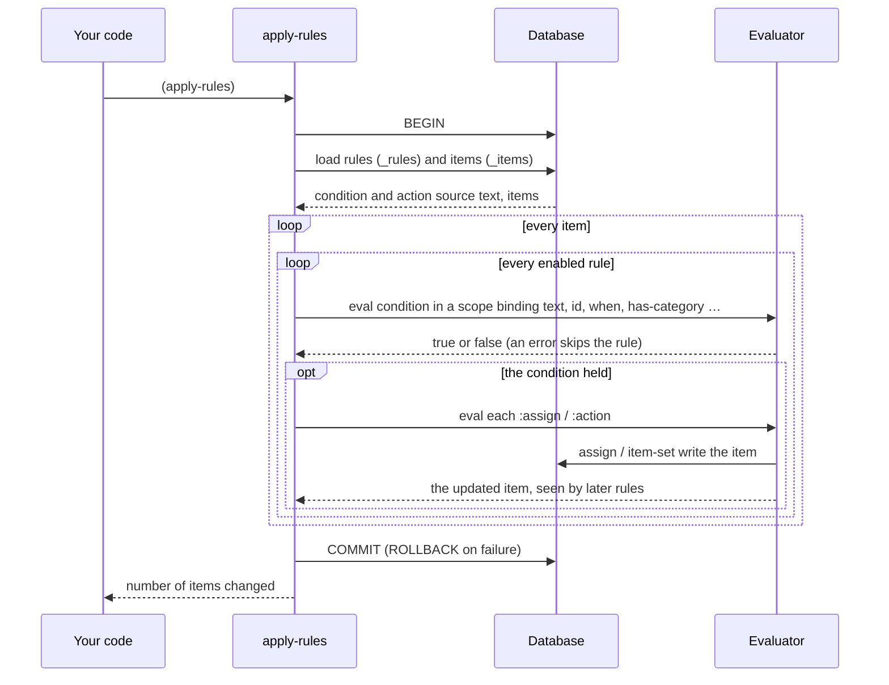

# 6. The agenda

The agenda is a personal information manager in the spirit of Lotus Agenda (1988). You write
things down as free text first. Structure comes later, partly from you and partly from *rules*
that read each item and file it. The agenda lives in the same SQLite database as your tables, in
tables whose names start with `_`.

## Items

```lisp
(add-item "call Bob" :when "2026-09-26" :priority 1)     ; explicit properties
(add-item "draft budget" :category "work" :notes "Q4 numbers")
(add-item-today "water the plants")                      ; due today
```

An item has text, notes, a list of categories, and any number of *properties*. `:when` and
`:priority` are properties, and so is anything a rule or `item-set` adds. Property values are
stored as strings.

```lisp
(item-get 1)                    ; → #<item 1: call Bob>
(item->dict (item-get 1))
; → {:id 1 :text "call Bob" :priority "1" :when "2026-09-26" :notes ""
;    :categories () :created "2026-09-25T15:50:07Z" :modified "…"}

(item-set 1 :priority 2 :notes "after 3pm")   ; text, notes or any property
(item-done 1)                   ; done: soft-deleted, or rolled forward if it recurs
(item-count)                    ; → how many items
```

### Finding items

`items` returns a result-set, which prints as a grid. The filters combine:

```lisp
(items)                                          ; everything
(items :category "work" :priority 1)
(items :search "budget" :when-before "2026-10-01")
(items :when-after "2026-09-01")
(items-on "2026-09-26")
(items-between "2026-09-01" "2026-12-31")       ; both ends included
(records (items :search "budget"))               ; as a list, for map and filter
```

### Writing it down in plain language

`add` parses a date, a priority and people out of ordinary text. `smart-parse` shows the parse
without storing anything:

```lisp
(smart-parse "lunch with Ana in 3 days high priority")
; → {:text "lunch with Ana" :when "2026-09-28" :priority 2 :who ("Ana")}

(smart-parse "email Carl 2026-10-12 !")
; → {:text "email Carl" :when "2026-10-12" :priority 3 :who ("Carl")}

(add "call Dana tomorrow urgent")                ; stores it
```

| It recognises | Examples | Becomes |
|---|---|---|
| An ISO date | `2026-10-12` | `:when` |
| Relative days | `today`, `tomorrow`, `yesterday`, `in 3 days`, `in 2 weeks` | `:when` |
| Urgency words | `urgent`, `asap` → 1 · `high priority` → 2 · `low priority` → 4 | `:priority` |
| Exclamation marks | `!!!` → 1 · `!!` → 2 · `!` → 3 | `:priority` |
| People | `@sam`, or a name after *call, email, meet, text, with, for, from* | `:who` |

### Recurrence

```lisp
(add-item "pay rent" :when "2026-10-01" :recur (every 1 :months))
(add-item "standup"  :when "2026-09-28" :recur :weekly)

(item-done 1)       ; the item is closed and a copy appears with :when "2026-11-01"
```

`(every n unit)` takes `:days`, `:weeks` or `:months`, and returns a recurrence string such as
`"every:1:months"`.

## Categories

Categories are paths. Filing an item under `work/calls` also puts it under `work` as far as
filters are concerned. `(has-category "work")` is true for it.

```lisp
(defcategory work/calls)
(assign 3 "work/calls")
(unassign 3 "work/calls")
(categories)          ; → "work\n  work/calls" — an indented tree
```

An **exclusive** parent allows only one of its children per item. Assigning a sibling replaces
the old one. That's how you model states that can't overlap:

```lisp
(defcategory priority :exclusive true :children (high low))
(assign 1 "priority/high")
(assign 1 "priority/low")      ; the item is now in priority/low only
```

## Rules

A rule is a condition and some actions, all written in EELisp. The engine stores both as text
in the `_rules` table. When rules run, each condition is read back and evaluated against every
item, with the item's fields bound as variables.

```lisp
(defrule calls
  :when   (str-matches text "call|phone|ring")
  :assign "work/calls")

(defrule tag-urgent
  :when   (str-matches text "(?i)urgent")
  :action (item-set id :priority 1))

(defrule ticket
  :when   (str-matches text "ticket #([0-9]+)")
  :action (item-set id :ticket (match 1)))       ; "fix ticket #42" gets :ticket "42"

(apply-rules)          ; every item → how many changed
(apply-rules 7)        ; just item 7
(auto-categorize true) ; from now on, run the rules on each new item as it's added
(rules)                ; → "calls: (str-matches text \"call|phone|ring\")\n…"
(drop-rule "calls")
```

`:assign` and `:action` may each appear more than once. Inside `:when` and `:action`, these names
are bound:

| Name | Is |
|---|---|
| `text`, `notes`, `id` | the item's own fields |
| `categories` | a list of category paths |
| `created`, `modified` | timestamps, as ISO strings |
| every property, such as `when`, `priority`, `who` | its value, a string |
| `(get :priority)` | one property by keyword; `nil` when absent |
| `(has-category "work")` | membership, parents included |
| `(overdue?)` | true when `when` is before today |
| `(match n)` | capture group `n` of the condition's regular expression |

A rule whose condition raises an error is skipped, as is an action that fails. One bad rule
can't stop the others. The whole pass runs in a **transaction**, so it's committed at the end or
rolled back if something below the rules fails.



Rules run in order of name, and each rule sees the changes made by earlier ones in the same pass.

## Views

A view is a saved query over the agenda. Its filter is an expression evaluated in the same scope
as a rule condition:

```lisp
(defview workboard :filter (has-category "work") :sort-by when)
(defview late      :filter (overdue?))
(defview p1        :filter (= priority "1"))       ; properties are strings
(defview by-prio   :group-by priority)             ; grouped: an outline, not a grid

(show workboard)       ; → a result-set
(views)                ; the saved views' names
(drop-view "late")
```

## Templates

```lisp
(deftemplate standup :text "standup" :priority 2 :category "work")
(from-template standup :when "2026-09-28")      ; a new item, template values filled in
(templates)                                     ; → "standup — standup"
(drop-template standup)
```

## Several agendas

Each agenda is its own database file, completely separate from the others. The item functions
act on the *current* agenda.

```lisp
(open-agenda "work.db")          ; → "Opened agenda: work" — and it becomes current
(agendas)                        ; → "work [active]\nmemory"
(use-agenda memory)              ; switch back to the engine's own database
(close-agenda work)

(export-agenda "memory" :format :json :path "backup.json")
(import-agenda "backup.json")    ; → "Imported 2 items, 0 templates" — in one transaction
```

Continue with [Sheets](07-sheets.md).
