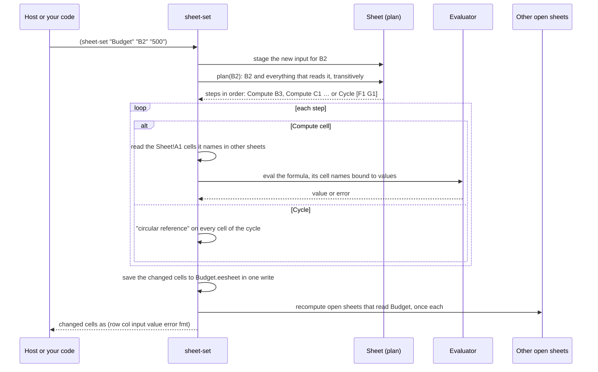

# 7. Sheets

A sheet is a spreadsheet whose formulas are EELisp. There's no separate formula language. A
formula is one expression after `=`, and inside it `B1` is a cell's value and `B1:B9` is a list
of values. Everything in the rest of these pages works inside a formula: `map`, `filter`,
`date-add`, even `count-records` against the database.

Each sheet is a SQLite file with the extension `.eesheet`. A sheet is named `"Budget"`,
`"money/Budget"` or by absolute path. A relative name resolves against the host's workspace
folder, `(current-dir)`, and `.eesheet` is implied.

## A first sheet

```lisp
(sheet-new "Budget")
(sheet-set "Budget" "A1"
           '(("rent"  "1200")
             ("food"  "450")
             ("total" "=(sum B1:B2)")))     ; a list of rows types a block

(sheet-get "Budget" "B3")                   ; → 1650
(sheet-set "Budget" "B2" "500")             ; B3 recalculates by itself
(sheet-get "Budget" "B3")                   ; → 1700
(sheet-rows "Budget" "A1:B3")               ; → (("rent" 1200) ("food" 500) ("total" 1700))
```

`sheet-set` returns the cells that changed, each one as `(row col input value error fmt)` with
rows and columns counted from 0. A host uses that list to repaint only what moved.

## What a cell holds

A cell keeps what was typed, its *input*, and the last value that input produced. How the input
is read:

| You type | It becomes |
|---|---|
| `1200` | the number 1200 |
| `rent` | the text "rent" |
| `'42` | the text "42", since a leading `'` forces text |
| `=(sum B1:B2)` | a formula |
| `50%` | 0.5, shown as a percentage |
| `$1,200.50`, `R$ 1.200,50` | money: 1200.5, with a currency format |
| `1 200,50` | 1200.5 |
| `2026-09-16` | a date, which sorts and takes part in date arithmetic |
| `16/09/2026` | text, because the sheet won't guess which part is the month |

Whichever of `.` or `,` comes last is taken as the decimal point. A lone comma before exactly
three digits separates thousands, so `1,200` is twelve hundred and `1,5` is one and a half. A
format already set on the cell wins over the guess.

## Inside a formula

| You write | It means |
|---|---|
| `B1` | the value in B1 (capitals only, since `b1` is an ordinary name) |
| `B1:B9` | the range as a flat list, with blanks as `nil` |
| `$B$1`, `B$1`, `$B1` | pinned whole, by row, or by column |
| `Rates!A1`, `Rates!A1:A9` | a cell or range in the sheet named `Rates`, in the same folder |
| `#REF!` | what a reference turns into when its cell is deleted |

```lisp
=(sum B1:B9)
=(round (/ B1 $B$3) 2)                         ; a share of the total; the pin survives filling
=(sum (filter (fn (x) (> x 400)) B1:B3))
=(* B2 Rates!A1)                               ; another sheet
=(date-format (today) "yyyy-MM-dd")
=(count-records people :where "city = ?" :params '("Lisbon"))
```

`sum`, `avg`, `min` and `max` skip blanks and text, so a range with labels in it still adds up.

## Recalculation

When a cell changes, the engine works out everything downstream of it and recomputes each
formula after the formulas it reads. Results are stored in the file, so **opening a sheet runs no
formula**. A sheet with ten thousand formulas opens as fast as one with none.

Formulas that read each other in a circle are found with Tarjan's strongly-connected-components
algorithm, run without recursion so that a long chain of running totals can't overflow the stack.
Every cell in the circle gets the same error rather than a wrong number:

```lisp
(sheet-set "Budget" "F1" "=(+ 1 G1)")
(sheet-set "Budget" "G1" "=(+ 1 F1)")
; both cells: error "circular reference between F1, G1"
```



Writing to a sheet also recomputes the other **open** sheets that read it, once each, so two
sheets naming each other settle down instead of bouncing back and forth. A formula that reads the
database, the clock or a sheet that wasn't open isn't tracked. Run `(sheet-recalc "Budget")` to
recompute everything.

## Moving things around

```lisp
(sheet-fill "Budget" "C1" "C2:C12")            ; copy C1 down; references shift per row
(sheet-copy "Budget" "B1:B3")                  ; → what was typed, as rows of text
(sheet-paste "Budget" "D1" (sheet-copy "Budget" "B1:B3") "B1")
                                               ; paste; formulas move by the distance travelled
(sheet-insert-rows "Budget" 3)                 ; rows numbered from 1; formulas follow their cells
(sheet-delete-rows "Budget" 3 2)               ; a reference to a deleted cell reads #REF!
(sheet-insert-cols "Budget" "B")
(sheet-delete-cols "Budget" "B" 2)
```

When rows or columns move, the engine rewrites the references in each formula's **text** and
keeps its spacing and comments. `=(sum B1:B2)` becomes `=(sum B2:B3)`, and nothing else in the
formula changes.

## Data in, data out

```lisp
(sheet-put "Report" "A1" (query people))       ; a header row, then the records
(sheet-put "Report" "A1" '((1 2) (3 4)))       ; values stay values: never re-read as input
(sheet-open "Budget")    ; everything a host needs to draw it: {:path :version :cells :widths :heights}
(sheet-version "Budget") ; a counter that moves on every write
(sheet-bytes "Budget")   ; the whole file as base64
(sheet-from-bytes "Copy" (sheet-bytes "Budget"))
(sheet-close "Budget")   ; let go of the file before renaming or deleting it
```

## Formatting

Formats are stored with the cell and are for the host to apply. The engine only keeps them and
moves them around.

```lisp
(sheet-format "Budget" "B1:B9" {:num "currency" :dp 2})
(sheet-format "Budget" "A1" {:bold true :bg "#fff3c4"})
(sheet-format "Budget" "A1:A9" nil)            ; clear
(sheet-col-width "Budget" "A" 160)
(sheet-row-height "Budget" 3 48)
```

The keys are `:num`, `:dp`, `:cur`, `:date`, `:bold`, `:italic`, `:align`, `:wrap`, `:bg`, `:fg`
and `:border`.

Continue with [A self-documenting language](08-self-documenting.md).
