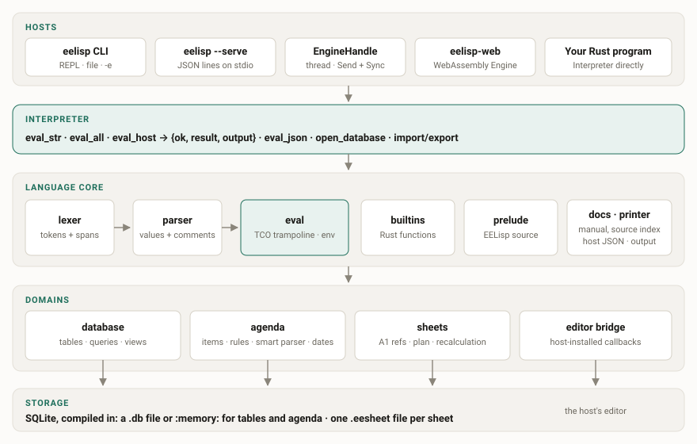
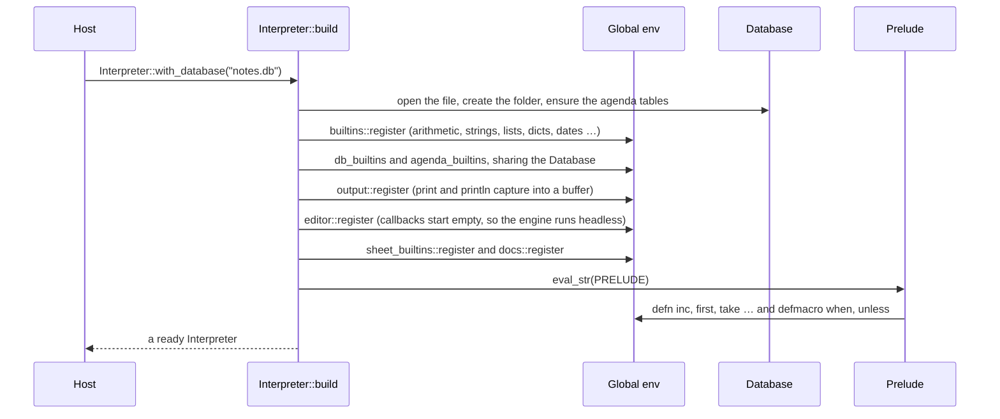
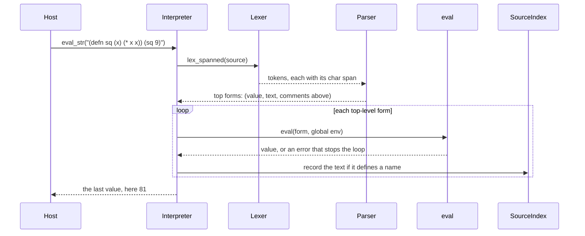
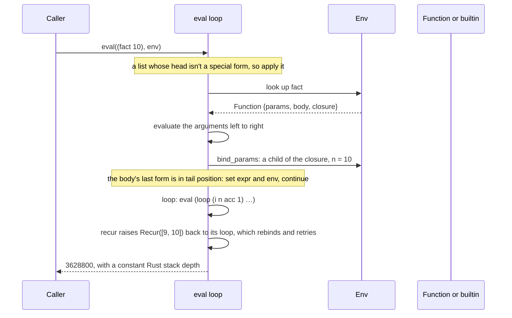

# 9. Architecture

This chapter is for people changing the engine, or embedding it and wanting to know what happens
beneath a call. The source is about 9 400 lines of Rust in `src/`, and the knowledge graph in
`graphify-out/` (built with `/graphify`) maps it symbol by symbol.

## The layers

| Layer | Files | Responsibility |
|---|---|---|
| Hosts | `bin/eelisp.rs`, `server.rs`, `web/src/lib.rs` | Turn a request (a line, a JSON object, a JS call) into `eval_host` |
| Interpreter | `interpreter.rs` | Build the environment, own the shared state, evaluate source |
| Reader | `lexer.rs`, `parser.rs` | Text → values, remembering each top-level form's text and comments |
| Evaluator | `eval.rs`, `env.rs` | Special forms, macros, application; the tail-call trampoline |
| Values | `value.rs`, `printer.rs`, `host.rs` | The `Value` enum; printing for people; tagged JSON for hosts |
| Library | `builtins.rs`, `prelude.rs`, `docs.rs`, `output.rs` | Core functions in Rust, the prelude in EELisp, the manual, output capture |
| Database | `database.rs`, `db_builtins.rs` | SQLite store with a JSON schema, soft delete, views |
| Agenda | `agenda.rs`, `agenda_builtins.rs`, `smart_parser.rs`, `dates.rs` | Items, categories, rules, recurrence, natural-language capture |
| Sheets | `sheet_ref.rs`, `sheet.rs`, `sheet_builtins.rs` | A1 addressing, the dependency graph, recalculation |
| Editor bridge | `editor.rs` | Functions whose behaviour the host installs as callbacks |

Two rules hold the design together:

1. **The core does no I/O of its own.** Apart from SQLite files, everything that touches the
   outside world is either a builtin the host can leave out (`http-get`) or a callback the host
   installs (`current-dir`, `buffer-text`). That's why the same crate compiles to WebAssembly.
2. **The interpreter is single-threaded.** Shared state is `Rc<RefCell<…>>`. A multi-threaded host
   uses `EngineHandle`, which keeps the interpreter on its own thread and hands out a
   `Send + Sync` handle (see [Embedding](10-embedding.md#holding-it-across-threads)).

## Start-up

`Interpreter::new()` builds one global environment and registers every module's builtins into it.
The modules share state, such as the database and the output buffer, through reference-counted
cells captured by their closures. Finally it evaluates the prelude, which is EELisp source.

## From text to value

`eval_str` reads all the top-level forms first, then evaluates them one at a time. After each
form is evaluated, its original text and the comment block above it are recorded in the
`SourceIndex`. That's what `(source f)` prints.

## The evaluator

`eval` is one function with a loop around a `match`. A form in **tail position** doesn't recurse.
It reassigns the current expression and environment and goes round the loop again, so the Rust
stack doesn't grow. The tail positions are the taken branch of `if`, the last form of
`do`/`begin`/`let`, the chosen `cond` branch, the last operand of `and`/`or`, and the last form of
a function body.

`loop`/`recur` works a little differently from a plain tail call. `recur` evaluates its arguments
and returns them as a special `Recur` signal. The nearest enclosing `loop` catches the signal,
rebinds its names and runs the body again. A `recur` with no enclosing `loop` reaches the top as
the error `recur used outside of a loop`.

### Application

When the head of a list evaluates to:

- a **macro**: the arguments are bound *unevaluated* in a scope made from the macro's closure, the
  body runs and returns code, and that code becomes the new expression. That's a tail step, so a
  macro expanding into a loop costs nothing extra.
- a **builtin**: arguments are evaluated according to the builtin's *argument mode*, and then the
  Rust closure is called.
- a **function**: arguments are evaluated, a child of the function's closure scope is created with
  the parameters bound (the rest parameter collects the extras), and the body runs with its last
  form in tail position.

| Argument mode | Used by | Behaviour |
|---|---|---|
| `Eval` | almost everything | every argument is evaluated |
| `TableFirst` | `query`, `insert`, `count-records`, `show` … | the first argument is passed bare, unless it's a call, and the rest are evaluated |
| `AllRaw` | `deftable`, `defform`, `defrule`, `defview`, `defcategory` | nothing is evaluated; the forms are schema or stored code |

`AllRaw` is why a rule's `:when` isn't run when the rule is defined. It's stored as text and
evaluated later, once per item.

## Environments

An environment is a map from names to values plus a link to its parent. `def` writes to the scope
it's evaluated in, which is the global scope at top level. `let`, `loop`, `for-each` and function
calls each create a child scope. `set!` walks up the chain to the scope that holds the name.
Closures capture the environment they were created in, so a function returned from a `let` keeps
its variables alive.

Sheet formulas and rule conditions run in scopes made for the occasion. A formula runs in a child
of the **global** scope with its cell names bound, whatever scope called `sheet-set`. A rule runs
in a child scope that binds the item's fields.

## Values

`Value` is one Rust enum. Lists and dicts are behind `Rc`, so passing one around copies a pointer,
not the data. Nothing mutates a list or dict after it's built, which is what makes sharing safe.

| Group | Variants |
|---|---|
| Atoms | `Number(f64)`, `Str`, `Bool`, `Null`, `Symbol`, `Keyword` |
| Collections | `List(Rc<Vec<Value>>)`, `Dict(Rc<OrderedDict>)` |
| Code | `Function`, `Builtin`, `Macro` |
| Database | `Table`, `Record`, `ResultSet` |
| Agenda | `Item` |
| Views | `TableView`, `FormView`, the structured contract with a user interface |

`OrderedDict` keeps its keys in insertion order. That matters because records, forms and the
JSON a host receives all depend on field order.

## Where the data lives

| What | Stored in |
|---|---|
| Your tables | a table of the same name, plus `_id` and `_deleted` columns |
| Table schemas | JSON in `_eelisp_schema`, so types, defaults and choices survive a restart |
| Agenda | `_items`, `_categories`, `_rules`, `_views` and `_templates` in the same database |
| Rules and views | their conditions as EELisp **text**, re-read and evaluated when they run |
| Sheets | one `.eesheet` SQLite file each, with the input, the last value and the format of every cell |

Continue with [Embedding](10-embedding.md).
