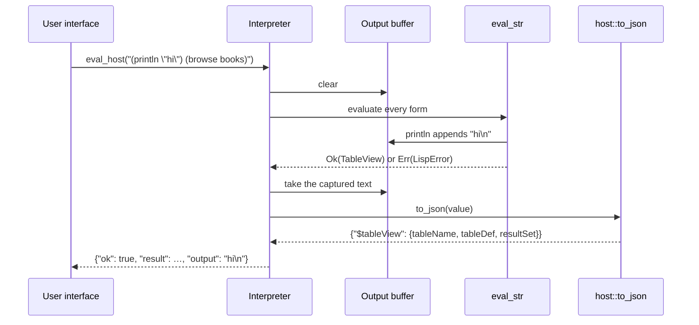
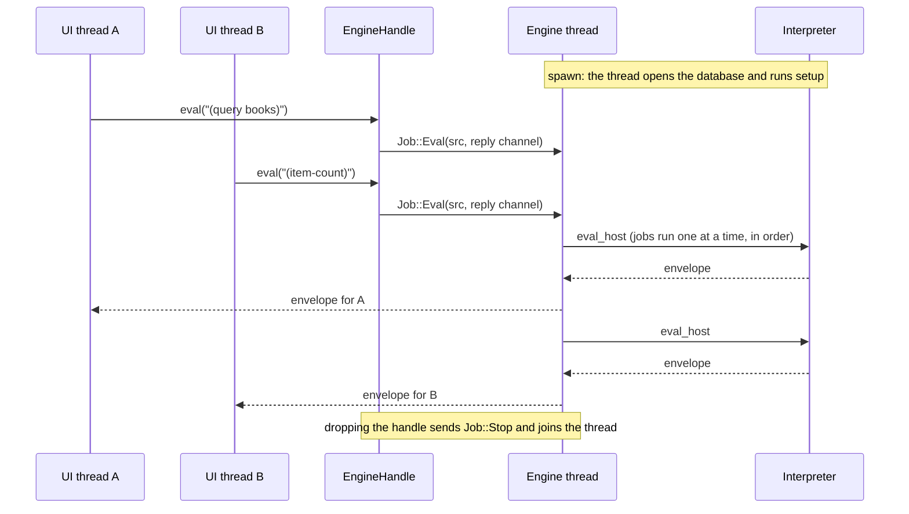
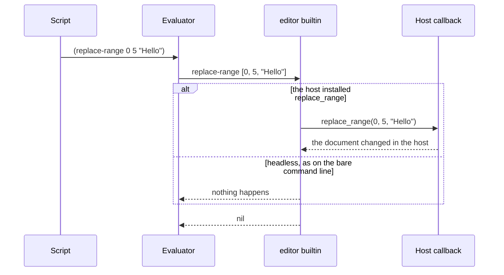

# 10. Embedding

The engine is a library first and a binary second. There are four ways to hold it, and all four
end at the same method, `Interpreter::eval_host`, so they all get the same answer:

| Host | Use it when | Entry point |
|---|---|---|
| Rust, directly | your program is Rust and single-threaded | `eelisp::Interpreter` |
| Rust, across threads | a Tauri app, or anything that shares state between threads | `eelisp::server::EngineHandle` |
| Any language | Node, Python, a shell script | `eelisp --serve` over stdin/stdout |
| A browser | a web page or Web Worker | `eelisp-web`, compiled to WebAssembly |

## From Rust

```toml
[dependencies]
eelisp = { git = "https://github.com/santacroce-tech/eelisp-rs" }
```

```rust
use eelisp::Interpreter;

let it = Interpreter::new();                          // in-memory database
let it = Interpreter::with_database("notes.db");      // on disk; panics if it can't open
let it = Interpreter::with_database_or_memory("notes.db");  // falls back to memory, says why

let v   = it.eval_str("(+ 1 2)")?;                    // → Value, the last form's result
let all = it.eval_all("(def x 1) (* x 41)")?;         // → Vec<Value>, one per form
let out = it.take_output();                           // what print/println produced
```

By default, `print` output is echoed to stdout, which suits a command line. Call
`it.set_echo(false)` in a host that wants to capture it instead.

## The JSON boundary

A user interface wants JSON, not `Value`. There are two methods for that:

```rust
let json: String = it.eval_json("(browse books)")?;   // the result as tagged JSON
let envelope: String = it.eval_host("(browse books)"); // the full envelope — never fails
```

`eval_host` is the method to build a UI on. It always returns a well-formed envelope, with any
error inside it rather than raised:

```json
{ "ok": true,  "result": 3.0, "output": "" }
{ "ok": true,  "result": [1.0, {"$kw": "a"}], "output": "hi\n" }
{ "ok": false, "error": "Type mismatch: expected list, got number", "output": "" }
```



### The JSON shape of values

Numbers, strings, booleans, `nil` and lists map to their JSON equivalents. Everything else becomes
an object with a single `$`-tagged key, so a TypeScript client can switch on the tag:

| Tag | Value | Shape |
|---|---|---|
| `$kw` / `$sym` | keyword / symbol | `{"$kw": "name"}` |
| `$dict` | dict | `{"$dict": [["name", "Ada"], ["born", 1815]]}`, a list of pairs so the key order survives |
| `$record` | database row | `{"$record": {"table", "id", "data": {…}}}` |
| `$resultSet` | query result | `{"$resultSet": {"table", "columns", "records": […]}}` |
| `$table` | table definition | `{"$table": {"name", "fields": [{name, type, required, choices}]}}` |
| `$item` | agenda item | `{"$item": {"id", "text", "notes", "categories", "properties", "created", "modified"}}` |
| `$tableView` | `(browse t)` | `{"$tableView": {"tableName", "tableDef", "resultSet"}}` |
| `$formView` | `(edit t id)`, `(defform …)` | `{"$formView": {…, "computedFields": [{name, type, expression}], "isStandalone"}}` |
| `$fn` / `$builtin` / `$macro` | code | `{"$fn": "square"}` |

That's how `(browse books)` becomes a real grid in EEditor instead of a string. A computed field
travels as the text of its expression, so a form can re-run it as the user types.

## Holding it across threads

`Interpreter` uses `Rc` and `RefCell`, so it can't cross threads. `EngineHandle` owns an
interpreter on a thread of its own and talks to it over a channel. The handle you keep is
`Send + Sync`, which is what a Tauri app stores in its state.

```rust
use eelisp::server::EngineHandle;

let engine = EngineHandle::spawn("notes.db".to_string());
let envelope: String = engine.eval("(+ 1 2)");       // {"ok":true,"result":3.0,"output":""}
engine.open_database("other/notes.db")?;             // move to another workspace between jobs
```



The database is opened on the engine's thread, so a slow or permission-gated folder holds up
evaluation but never your UI thread. If the file can't be opened, the engine runs in memory and
`(database-info)` reports `:error`.

## Giving the language new powers

The editor functions (`buffer-text`, `cursor-pos`, `replace-range` and the rest) aren't built
into the language. The host installs them as callbacks. Until it does, they're inert: reads
return `""` or `nil`, and writes do nothing. This is the intended way to extend EELisp. The engine
stays free of I/O and platform types, and the embedder decides what the language can reach.

With `EngineHandle`, install the callbacks in `spawn_with`. It runs on the engine thread before the
first job, so anything it captures must be `Send`. An `Arc<Mutex<…>>` that the host also holds is
the usual shape.

```rust
use std::sync::{Arc, Mutex};

let doc = Arc::new(Mutex::new(String::from("hello")));
let d = doc.clone();
let engine = EngineHandle::spawn_with(":memory:".into(), move |it| {
    let mut ed = it.editor.borrow_mut();
    let r = d.clone();
    ed.buffer_text = Some(Box::new(move || r.lock().unwrap().clone()));
    ed.current_dir = Some(Box::new(|| "/Users/me/notes".into()));
});
engine.eval("(str-len (buffer-text))");     // → 5
```

| Callback | EELisp function |
|---|---|
| `buffer_text` | `(buffer-text)` |
| `current_file` | `(current-file)` |
| `current_dir` | `(current-dir)`, which is also where sheet names resolve |
| `cursor_pos` / `set_cursor` | `(cursor-pos)` / `(set-cursor n)` |
| `selection` | `(selection)` → `(from to)` |
| `insert_at` | `(insert-at pos text)` |
| `replace_range` | `(replace-range from to text)` |



## From any language: `--serve`

`eelisp --serve` reads one request per line on stdin and writes one envelope per line on stdout.
There are no sockets, no ports and no protocol library. A request is either a JSON object with a
`src` field, or bare EELisp that's gathered across lines until its brackets balance.

```text
$ eelisp --serve --db notes.db --workspace ~/notes
{"src": "(+ 1 2)"}
{"ok":true,"output":"","result":3.0}
(+ 1
   2)
{"ok":true,"output":"","result":3.0}
```

`--db` keeps tables and the agenda in a file; without it they're in memory. `--workspace` sets
what `(current-dir)` answers. Driving it from Node takes about ten lines:

```js
import { spawn } from "node:child_process";
import readline from "node:readline";

const child = spawn("eelisp", ["--serve"], { stdio: ["pipe", "pipe", "inherit"] });
const rl = readline.createInterface({ input: child.stdout });
const queue = [];
rl.on("line", (l) => queue.shift()?.(JSON.parse(l)));

const ev = (src) =>
  new Promise((res) => (queue.push(res), child.stdin.write(JSON.stringify({ src }) + "\n")));

await ev("(deftable books (title:string))");
```

## In a browser: `eelisp-web`

`web/` compiles the whole engine, SQLite included, to WebAssembly. That's about 1 MB gzipped, and
it starts in around 20 ms. One `Engine` is one interpreter with its own in-memory database. It
has no thread: it runs on the page, or on a Web Worker.

```js
import init, { Engine } from "./pkg/eelisp_web.js";
await init();

const e = new Engine();
JSON.parse(e.eval('(deftable pets (name:string)) (insert pets {:name "Rex"}) (query pets)'));

const bytes = e.exportDb();     // the database as a SQLite file, to keep between visits
e.importDb(bytes);              // …and back
e.changes();                    // rows changed since open or import: something new to save?
e.importSheet("examples/Budget", sheetBytes);
e.exportSheet("examples/Budget");
JSON.parse(e.sheetVersions());  // [["examples/Budget.eesheet", 7], …]
```

Build it with `web/build.sh`. The browser build leaves out `http-get` and `http-post` (they say
so instead of crashing), `EngineHandle` (there are no threads), and agenda file export/import
(there's no filesystem).

## Building

```bash
git clone https://github.com/santacroce-tech/eelisp-rs
cd eelisp-rs
cargo test                          # the acceptance suite
cargo build --release --bin eelisp  # the CLI
cargo llvm-cov --summary-only       # line coverage, if cargo-llvm-cov is installed
```

SQLite is compiled in through `rusqlite`'s `bundled` feature, so the binary doesn't depend on a
system SQLite. The `http` feature, on by default, adds `ureq` for `http-get` and `http-post`.
Build with `--no-default-features` to leave the network out. The engine is MIT licensed.

That's the whole engine. The [function reference](reference.md) lists everything callable from
EELisp.
